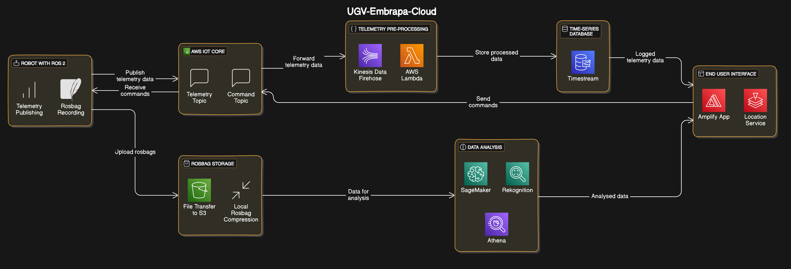

# UGV-Embrapa-Cloud



Refer to https://github.com/MekhyW/aws-iot-robot-connectivity-samples-ros2 to learn how to connect ROS2 robots to AWS IoT Core

## Project Structure

- `terraform/` - Contains all infrastructure as code files
- `templates/` - Contains policy and configuration templates for IoT devices
- `amplify_app/` - Directory for the dashboard/control application code

## Prerequisites

- AWS CLI configured with appropriate credentials
- Terraform installed
- GitHub personal access token

## Deployment Instructions

1. Navigate to the terraform directory:
```bash
cd terraform
```

2. Initialize Terraform:
```bash
terraform init
```

3. Create a `terraform.tfvars` file with your GitHub access token:
```hcl
github_access_token = "your-github-token"
```

4. Review the planned changes and apply them:
```bash
terraform plan
terraform apply
```

5. After successful deployment, Terraform will output important values including:
- IoT endpoint address
- Certificate and private key for IoT devices
- RosBag S3 bucket name
- Timestream database and table names

## Template Files

The `templates/` directory contains important JSON templates:
- `iot_policy_template.json` - Base IoT policy for device permissions
- `shadow_policy_template.json` - Policy template for device shadows
- `iot_config_template.json` - Configuration template for IoT device connection

## Dashboard Development

The `amplify_app/` directory is prepared for your dashboard application code. The infrastructure includes:
- AWS Amplify hosting
- Location Services integration
- IoT Core connectivity
- Timestream data access

To deploy your dashboard:
1. Place your React/Next.js application code in the `amplify_app/` directory
2. Push changes to your GitHub repository
3. Configure Amplify to automatically build and deploy your application

## Clean Up

To remove all created resources:
```bash
terraform destroy
```

Note: This will delete all resources including stored data. Make sure to backup any important information before destroying the infrastructure.
