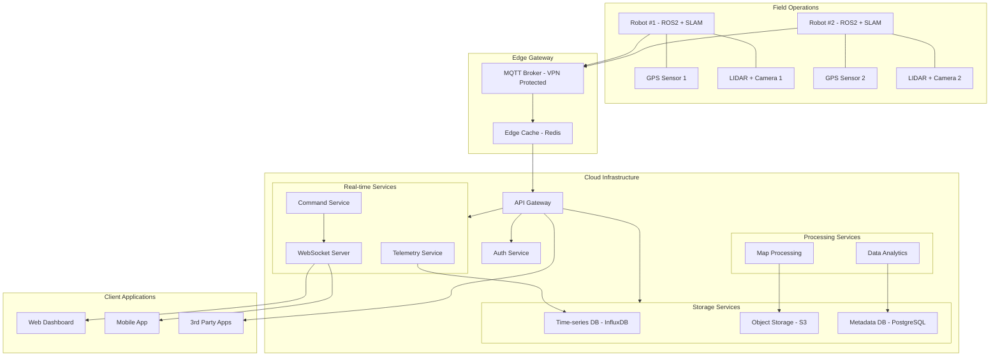

```mermaid
graph TB
    subgraph FO[Field Operations]
        R1[Robot #1 - ROS2 + SLAM]
        R2[Robot #2 - ROS2 + SLAM]
        GPS1[GPS Sensor 1]
        LID1[LIDAR + Camera 1]
        GPS2[GPS Sensor 2]
        LID2[LIDAR + Camera 2]
        
        R1 --- GPS1
        R1 --- LID1
        R2 --- GPS2
        R2 --- LID2
    end
    
    subgraph EG[Edge Gateway]
        MQTT[MQTT Broker - VPN Protected]
        EC[Edge Cache - Redis]
    end
    
    subgraph CI[Cloud Infrastructure]
        AG[API Gateway]
        AS[Auth Service]
        
        subgraph RTS[Real-time Services]
            TS[Telemetry Service]
            CS[Command Service]
            WS[WebSocket Server]
        end
        
        subgraph SS[Storage Services]
            TD[Time-series DB - InfluxDB]
            OS[Object Storage - S3]
            MD[Metadata DB - PostgreSQL]
        end
        
        subgraph PS[Processing Services]
            MP[Map Processing]
            DA[Data Analytics]
        end
    end
    
    subgraph CA[Client Applications]
        WUI[Web Dashboard]
        MA[Mobile App]
        TP[3rd Party Apps]
    end
    
    R1 & R2 --> MQTT
    MQTT --> EC
    EC --> AG
    
    AG --> AS
    AG --> RTS
    AG --> SS
    
    WS --> WUI & MA
    AG --> TP
    
    TS --> TD
    CS --> WS
    
    MP --> OS
    DA --> MD
```